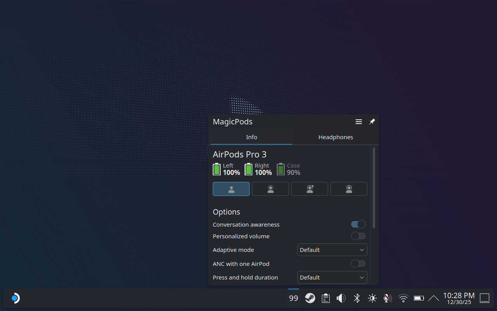

# MagicPods ✨ Plasmoid for KDE 6

A KDE 6 widget that allows you to control AirPods, Beats, and Galaxy Buds headphones directly from the panel.



## 🎨 Features

🔋 Battery level  
⚙️ Noise control  
🔌 Bluetooth control  
🎙️ Connect and disconnect headphones  
🎉 New features coming soon  

### 🔥 Exclusive to AirPods and Beats

Additional settings — just like on iPhone and Mac:

- Audio is lowered during conversation awareness
- Noise level adjustment in adaptive mode
- Personalized volume
- Noise cancellation with one AirPod
- Press duration adjustment
- Press and hold duration adjustment
- Customization of single and double tap for call control

## 🎧 Headphones supported

| Apple            | Beats                  | Samsung           |
| ---------------- | ---------------------- | ----------------- |
| AirPods 1        | PowerBeats Pro         | Galaxy Buds       |
| AirPods 2        | PowerBeats Pro 2       | Galaxy Buds Plus  |
| AirPods 3        | PowerBeats 3           | Galaxy Buds Live  |
| AirPods 4        | PowerBeats 4           | Galaxy Buds Pro   |
| AirPods 4 (ANC)  | Beats Fit Pro          | Galaxy Buds 2     |
| AirPods Pro      | Beats Studio Buds      | Galaxy Buds 2 Pro |
| AirPods Pro 2    | Beats Studio Buds Plus | Galaxy Buds FE    |
| AirPods Pro 3    | Beats Studio Pro       | Galaxy Buds 3     |
| AirPods Max      | Beats Solo 3           | Galaxy Buds 3 Pro |
| AirPods Max 2024 | Beats Solo Pro         |                   |
|                  | Beats Studio 3         |                   |
|                  | Beats X                |                   |
|                  | Beats Flex             |                   |
|                  | Beats Solo Buds        |                   |

## 💾 Installation

The widget requires the [MagicPodsCore](https://github.com/steam3d/MagicPodsCore/) backend to work.  
It is included with [MagicPodsDecky](https://github.com/steam3d/MagicPodsDecky/) or can be downloaded separately.

Copy the widget files:

```
tmp=$(mktemp -d) \
&& git clone https://github.com/steam3d/MagicPodsPlasmoid "$tmp" \
&& rsync -a --delete "$tmp/src/" ~/.local/share/plasma/plasmoids/app.magicpods.plasmoid/ \
&& rm -rf "$tmp"
```

Restart KDE 6:

```
systemctl --user restart plasma-plasmashell.service
```

## 🚀 Getting started

1. Start **MagicPodsCore** if you haven’t already  
   (MagicPodsDecky users can skip this step).
2. Right-click on the panel and select **Add or Manage Widgets**.
3. Find **MagicPods** in the list.
4. The MagicPods icon will appear in the panel.

## 🧪 Ideas and bugs

In the [Discord](https://discord.com/invite/UyY4PY768V) community you can suggest an idea or report a problem.

## 💰 Donate

[Support the project here](https://magicpods.app/donate/) — every bit helps ❤️